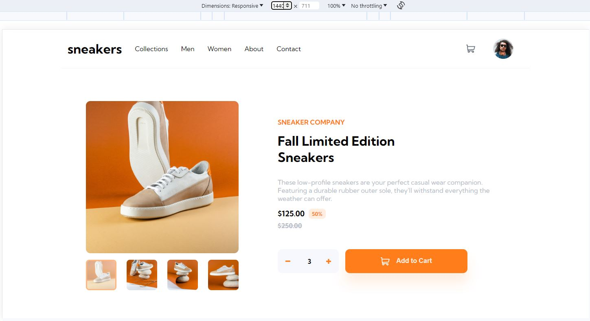
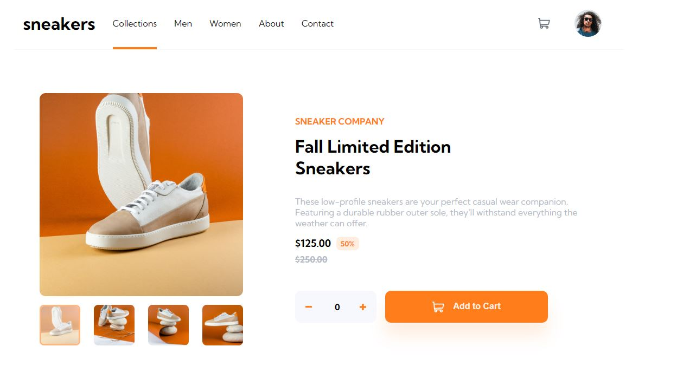
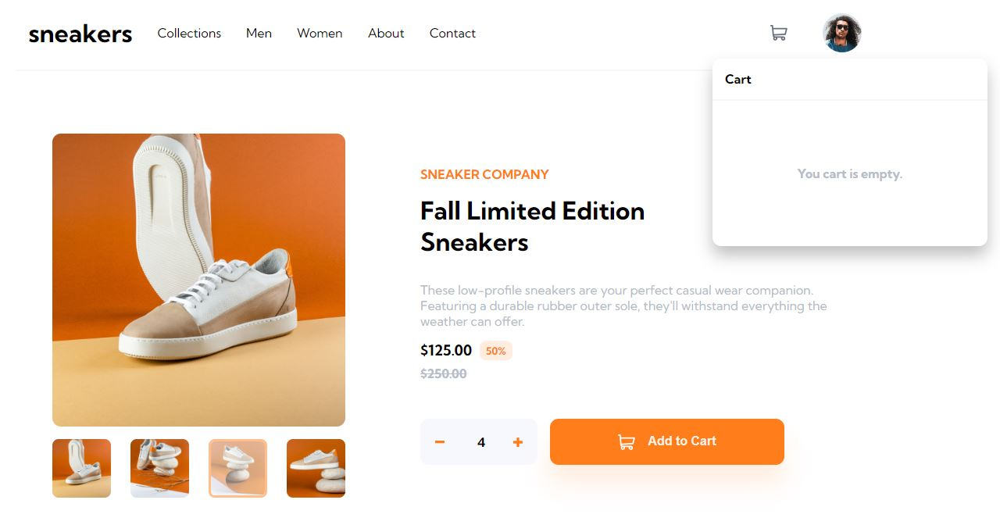
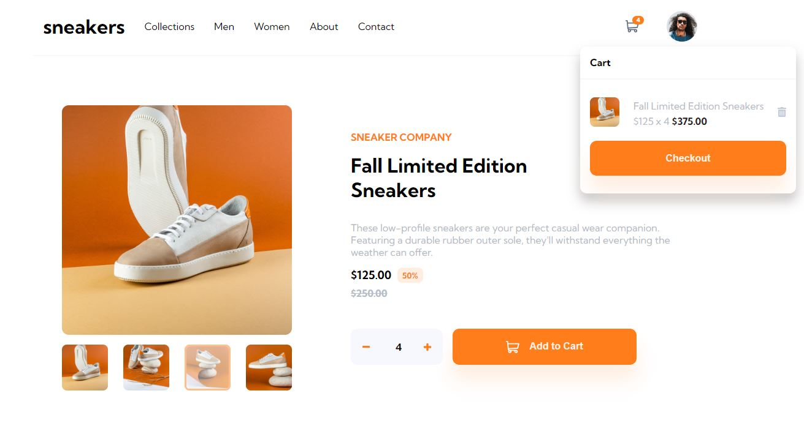
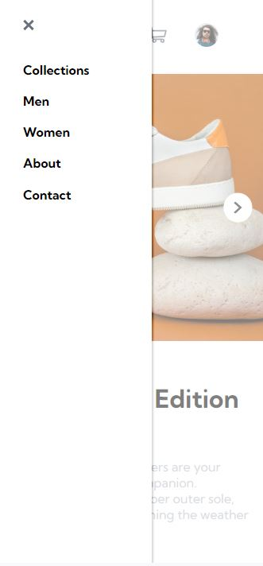

# E-commerce Product Page 🛒

## Challenge Overview

This project is a response to the E-commerce product page challenge provided by Frontend Mentor. The goal is to recreate the provided design as accurately as possible, implementing various interactive features and ensuring a responsive layout.

## Tech Stack 🚀

- React (with Vite for project setup)
- HTML
- CSS
- JavaScript
- VS Code

## Hosted Link 🌐

[Live Demo](https://vinayak9669.github.io/E-commerceWebsite-frontend-mentor-challenge/)

[GitHub Repository](https://github.com/VINAYAK9669/E-commerceWebsite-frontend-mentor-challenge)

## User Interaction ✨

- 🌟 Open a lightbox gallery by clicking on the large product image
- 🔄 Switch the large product image by clicking on the small thumbnail images
- 🛍️ Add items to the cart
- 🛒 View the cart and remove items from it
- 📱 View the optimal layout for the site depending on their device's screen size
- 🖱️ See hover states for all interactive elements on the page

## Learning Experience 📚

- 🔄 Implementing the useState Hook
- ⚡ Implementing short-circuit logic in React and using the ternary operator
- 🚀 Implementing state lift to manage shared state between components
- 💻 Using Components and CSS modules for a modular and maintainable codebase
- 🎨 Utilizing advanced animation effects to enhance the user experience

## Screenshots 📷
### Main Page

### Navbar Animation

### Navbar Desktop cart when empty

### Navbar Desktop cart when Full

### Navbar in Mobile Device

